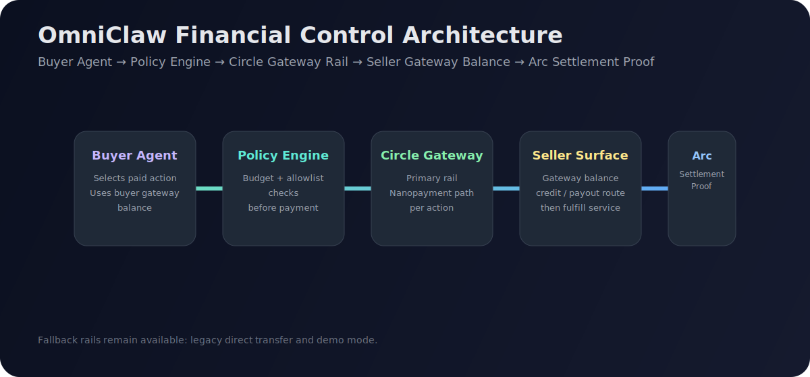
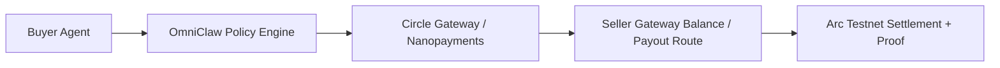
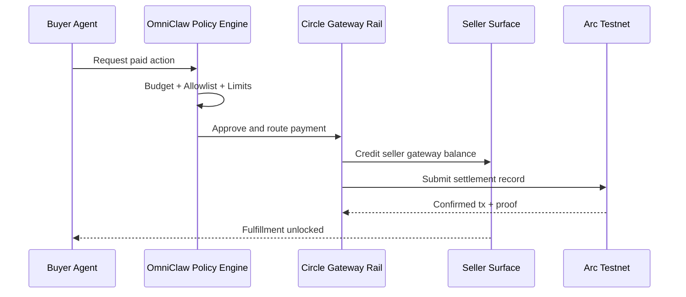

<div align="center">


<p>
  
  
  
  
</p>

<p><b>Autonomous Commerce. Controlled.</b><br/>Built for the Arc + Circle hackathon with a Gateway-first payment architecture.</p>

</div>

---

## What This Is (In Plain English)

OmniClaw is a payment control console for AI agents.

When a buyer agent wants to pay for a service:

1. OmniClaw checks rules (budget, allowlist, limits)
2. Payment goes through the **Circle Gateway rail** (primary path)
3. Seller gets credited via **Gateway balance / payout route**
4. Settlement proof appears on **Arc Testnet**

This means the app is not just "send wallet A to wallet B". It is a policy-controlled, programmable payment flow for per-action commerce.

---

## Visual Architecture



### System Flow Diagram



### Sequence (What happens on each payment)



---

## Product Modes

| Mode | Purpose | Status |
|---|---|---|
| `gateway` | **Primary** hackathon-aligned rail | Active default |
| `direct` | Legacy direct transfer fallback | Supported |
| `demo` | No live credentials / simulated flow | Supported |

---

## Why Gateway-First

- Better story for programmable per-action commerce
- Cleaner buyer/seller balance semantics
- Easy to explain to non-technical judges/users
- Arc still provides settlement proof layer

---

## Current Implementation Status

- ✅ Circle W3S integration working
- ✅ Arc settlement/proof links working
- ✅ Distinct buyer/seller wallets supported and validated
- ✅ Gateway-first rail selection in routing + UI
- ✅ Legacy direct path retained as fallback (non-breaking)

---

## Endpoints You Can Check

- `GET /api/integrations/health`
  - includes `gatewayConfigured`, `directTransferConfigured`, `activePaymentRail`
- `GET /api/integrations/circle/wallet-overview`
- `GET /api/integrations/circle/buyer-wallet`
- `GET /api/integrations/circle/seller-wallet`
- `GET /api/integrations/circle/buyer-history`
- `GET /api/integrations/circle/seller-history`
- `POST /api/demo/execute`

---

## Run Locally

```bash
pnpm install
pnpm dev
```

Open: [http://localhost:3000](http://localhost:3000)

---

## Environment Setup (Quick)

Use split actor config:

- Buyer: `CIRCLE_BUYER_*`
- Seller: `CIRCLE_SELLER_*`
- Arc: `ARC_RPC_URL`, `ARC_EXPLORER_URL`

Optional rail controls:

- `CIRCLE_GATEWAY_ENABLED=true`
- `OMNICLAW_FORCE_DIRECT_RAIL=false`

> `.env` and `.env.local` are ignored and should never be pushed.

---

## Developer Structure

```text
src/lib/payments/
  types.ts
  router.ts
  gateway.ts   # primary rail behavior
  direct.ts    # legacy fallback
```

---

## Non-Technical Summary

Think of OmniClaw like a smart cashier for AI agents:

- It verifies rules before spending
- It uses Gateway as the main payment rail
- It records settlement proof on Arc
- It unlocks the seller service only after confirmed payment

---

## License

MIT
