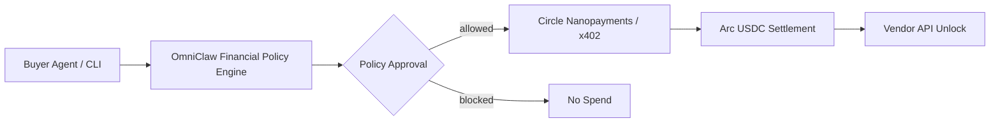
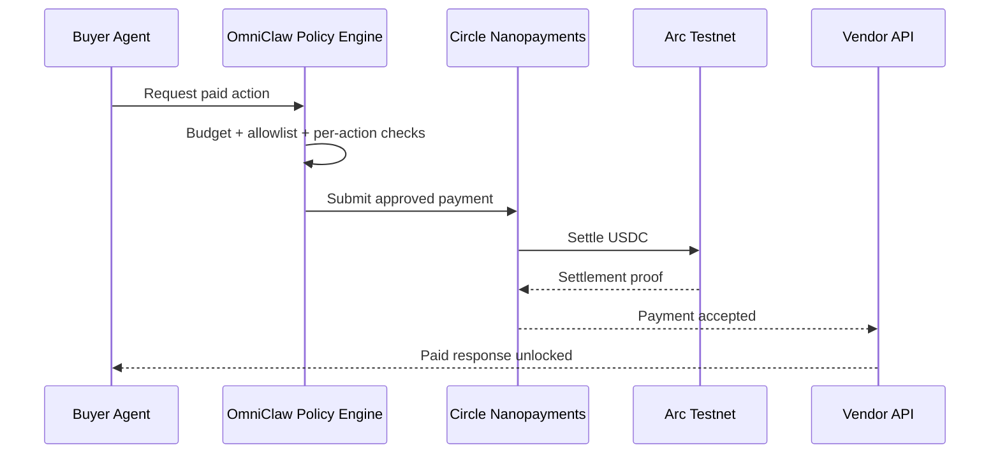

<div align="center">


<p>
  
  
  
  
</p>

<p><b>Autonomous agents should not hold raw wallet power.</b><br/>OmniClaw lets agents pay for API calls and compute through policy-controlled Circle Nanopayments with Arc-visible USDC settlement proof.</p>

</div>

---

## The Problem

Arc and Circle Nanopayments make sub-cent machine payments economically viable.

The remaining blocker is control.

If an AI agent needs a human approval for every action, autonomy breaks. If the agent receives direct wallet authority, one bad prompt, tool call, or policy mistake can turn into uncontrolled spend.

OmniClaw solves that middle layer.

## What OmniClaw Does

OmniClaw is the financial control layer for agentic commerce.

When a buyer agent wants to pay for a vendor service:

1. The agent requests a paid action.
2. OmniClaw checks budget, recipient allowlist, network, and per-action limits.
3. The approved payment routes through Circle Nanopayments / Arc USDC settlement.
4. The vendor response unlocks only after settlement proof exists.

The agent gets policy, not keys.

## Hackathon Alignment

This submission is built for the Circle Nanopayments + Arc agentic economy challenge.

| Requirement | OmniClaw demo response |
|---|---|
| Real per-action pricing `<= $0.01` | Demo services are priced at `$0.001`, `$0.003`, and `$0.005` |
| 50+ transaction proof | Console surfaces a `64+` transaction proof target for the demo run |
| Margin explanation | Shows why `$0.001/action` fails with normal gas but works with Arc + Nanopayments |
| Agentic economy | Buyer agent pays; vendor service earns; policy remains in control |
| Arc settlement | Receipts link to ArcScan when live settlement is configured |

## Why This Wins

Many hackathon projects will show that an agent can pay.

OmniClaw shows the part enterprises and serious agent builders need before they can trust that flow:

- agents do not touch raw private keys
- every payment is checked before settlement
- vendor APIs can charge per request
- transaction frequency and margin economics are visible
- Arc provides proof, Circle provides the nanopayment rail, OmniClaw governs authority

## Visual Architecture




## Demo Flow

The console has two important paths:

- approved seller: payment routes after policy approval and unlocks the vendor response
- unapproved seller: the buyer agent tries to pay, but OmniClaw blocks the payment before settlement



## Product Modes

| Mode | Purpose | Status |
|---|---|---|
| `gateway` | Circle Nanopayments / Arc-aligned primary product story | Active default |
| `direct` | Explicit Arc USDC fallback for local W3S-only testing | Supported |
| `demo` | No live credentials / simulated proof flow | Supported |

The code is intentionally explicit when a local fallback is used. The product story remains OmniClaw policy first, Circle Nanopayments second, Arc proof third.

## Current Implementation Status

- OmniClaw policy-control narrative in the UI
- Sub-cent service prices aligned to the hackathon requirement
- Approved and rejected seller paths so judges can see policy enforcement, not only happy-path payment
- Distinct buyer and seller wallet configuration
- ArcScan-ready receipt links for live transactions
- Buyer/seller transaction history panels
- Margin proof and 50+ transaction proof surfaces
- Local fallback path kept transparent for demos without full live credentials

## Run Locally

```bash
pnpm install
pnpm dev
```

Open: [http://localhost:3000](http://localhost:3000)

Run the animated demo:

```text
http://localhost:3000/console?autorun=true
```

## Environment Setup

Use split actor config:

- Buyer: `CIRCLE_BUYER_*`
- Seller: `CIRCLE_SELLER_*`
- Arc: `ARC_RPC_URL`, `ARC_EXPLORER_URL`
- Optional OmniClaw backend: `OMNICLAW_API_URL`, `OMNICLAW_API_TOKEN`

Optional rail controls:

- `CIRCLE_GATEWAY_ENABLED=true`
- `OMNICLAW_FORCE_DIRECT_RAIL=false`

`.env` and `.env.local` are ignored and should never be pushed.

## Key Endpoints

- `GET /api/integrations/health`
- `GET /api/integrations/circle/wallet-overview`
- `GET /api/integrations/circle/buyer-wallet`
- `GET /api/integrations/circle/seller-wallet`
- `GET /api/integrations/circle/buyer-history`
- `GET /api/integrations/circle/seller-history`
- `POST /api/demo/execute`

## Developer Structure

```text
src/lib/demo/data.ts          # hackathon proof constants, services, policy events
src/lib/payments/router.ts    # rail selection
src/lib/payments/gateway.ts   # nanopayment-aligned rail / explicit local fallback
src/lib/payments/direct.ts    # Arc USDC transfer fallback
src/app/console/page.tsx      # proof dashboard and animated transaction flow
```

## Non-Technical Summary

OmniClaw is a smart cashier for AI agents.

The agent can request a paid action, but OmniClaw decides whether that action is allowed. Circle Nanopayments moves USDC cheaply. Arc proves settlement. The vendor unlocks only after payment.

That is the missing control layer for the agent economy.

## License

MIT
